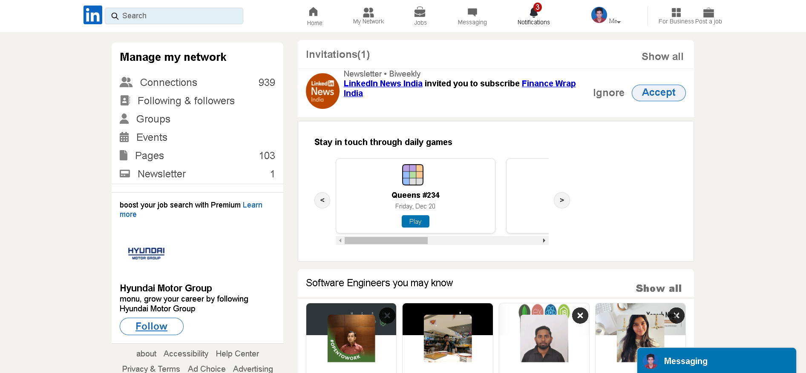

# LinkedIn Clone

## Introduction
This project is a simple LinkedIn-style profile application built using HTML, CSS, and JavaScript. It implements localStorage to handle user signup, login, and logout functionality.

## Project Type
Frontend 

## Deplolyed App
Frontend: https://deployed-site.whatever
Backend: https://deployed-site.whatever
Database: Local Storage of Browser

## Directory Structure
.
├── linkedin.html       # Main landing page (Signup and Login forms)
├── profile.html     # User profile page (Post-login)
├── styles.css       # CSS file for styling
├── script.js        # JavaScript file for functionality


## Video Walkthrough of the project
Attach a very short video walkthough of all of the features [ 1 - 3 minutes ]

## Video Walkthrough of the codebase
Attach a very short video walkthough of codebase [ 1 - 5 minutes ]

## Features
List out the key features of your application.
- Feature 1
- Feature 2
- Feature 3

## design decisions or assumptions
List your design desissions & assumptions

## Installation & Getting started
Detailed instructions on how to install, configure, and get the project running. For BE/FS projects, guide the reviewer how to check mongodb schema etc.

```bash
npm install my-project
cd my-project
npm start
```

## Usage
Provide instructions and examples on how to use your project.

```bash
# Example

```
## Sign-up Page


## Sign-in Page


## Home Section

Include screenshots as necessary.

## My-Network Section


## Jobs-Section


## Notifications


## My Profile-Section 


## Credentials
Provide user credentials for autheticated pages

## APIs Used
If your application relies on external APIs, document them and include any necessary links or references.

## API Endpoints
In case of Backend Applications provide a list of your API endpoints, methods, brief descriptions, and examples of request/response.
GET /api/items - retrieve all items
POST /api/items - create a new item


## Technology Stack
List and provide a brief overview of the technologies used in the project.

- HTML
- CSS
- Javascript
- Other libraries/modules